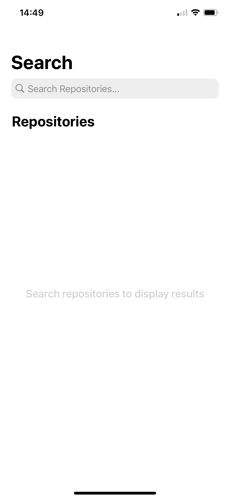
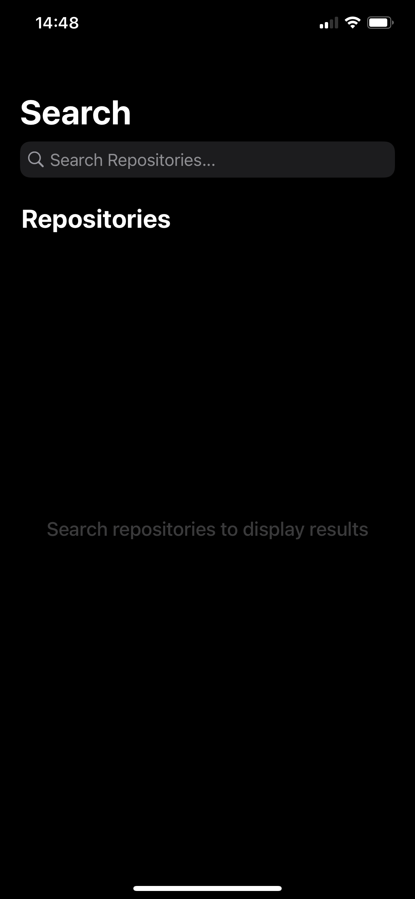

    

# GitHub Repo 
Application made for iPhone that allows user to browse GitHub repositories. Find repository that you are looking for, check it's details and share with your friends!

## Screenshots
# Light mode

    
    
    

# Dark mode

    
    
    

## Features
- Support for light and dark mode
- Searching 20 the most popular repositories according to searched name
- Displaying last 3 commits of the chosen repository
- Button that allows to open repository in a browser
- Button that allows to share chosen repository

## Usage
Clone this repository, open at the Xcode and turn it on at your iPhone using `Command + R`.

## Author
Patryk Krajnik • patrykkrajnik@icloud.com

## License
Project based on [MIT License](LICENSE.md)