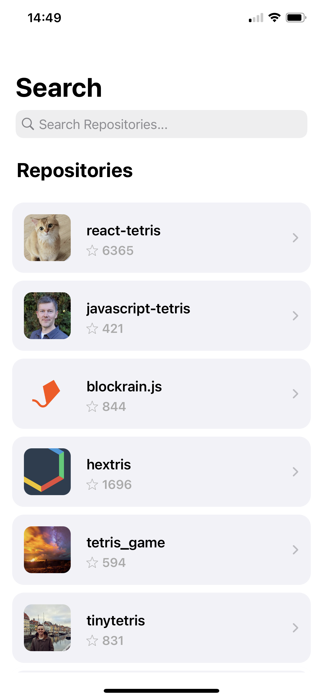
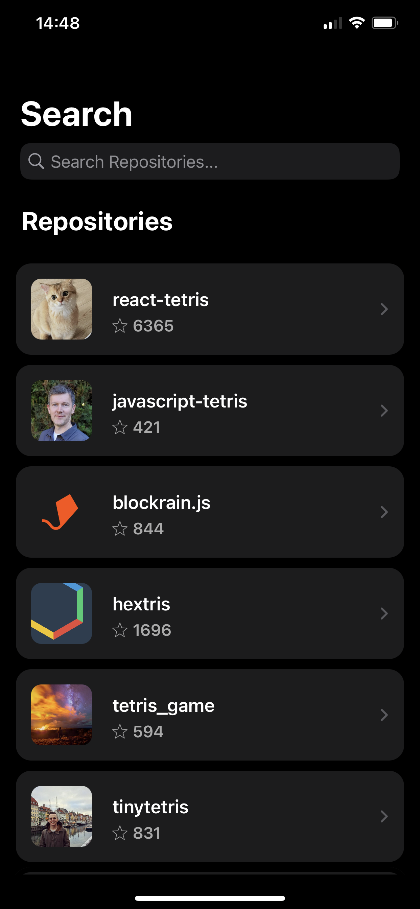

    

# GitHub Repo 
Application made for iPhone that lets user to browse GitHub repositories. Find repository that you are looking for, check it's details and share with your friends!

## Screenshots
### Light mode

    
    

### Dark mode

    
    

## Features
- Content based at [GitHub API](https://docs.github.com/en/rest)
- Support for light and dark mode
- Searching 20 the most popular repositories according to searched name
- Displaying last 3 commits of the chosen repository
- Button that allows to open repository in a browser
- Button that allows to share chosen repository

## Project structure
- [`GitHub Repo/Repo Search`](GitHub%20Repo/GitHub%20Repo/Repo%20Search) - components responsible for a Search View Controller
- [`GitHub Repo/Repo Details`](GitHub%20Repo/GitHub%20Repo/Repo%20Details) - components responsible for a Details View Controller
- [`GitHub Repo/Models`](GitHub%20Repo/GitHub%20Repo/Models) - structures to store downloaded data
- [`GitHub Repo/Coordinator`](GitHub%20Repo/GitHub%20Repo/Coordinator) - application flow between View Controllers

## Usage
Clone this repository, open at the Xcode and turn it on at your iPhone using `Command + R`.

## Author
Patryk Krajnik • patrykkrajnik@icloud.com

## License
Project based on [MIT License](LICENSE.md)
